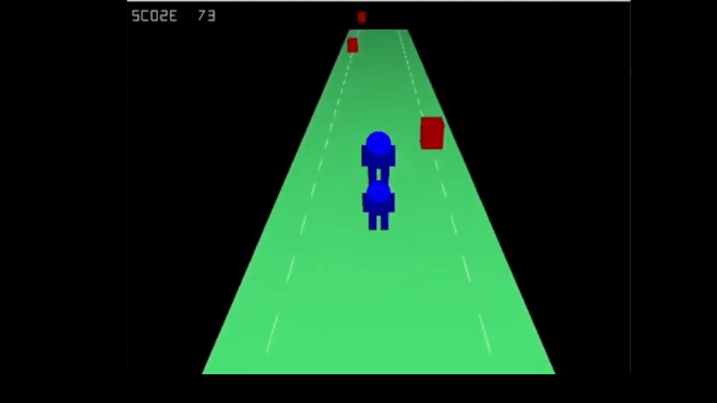

# Breakline – Final Project for CSC 313: Graphics and Visual Computing

This is my final project for **CSC 313: Graphics and Visual Computing** at **California Baptist University**. I completed this during my **sophomore year**, even though it was a **senior-level course** — making it an especially challenging but rewarding experience.

## Project Overview

**Runner Game** is a top down obstacle-dodging infinite running game where a character and their teammate must survive as long as possible by avoiding incoming hazards. Players must **jump over or dodge** obstacles, in a fast-paced gameplay loop inspired by games like *Temple Run* or *Maze Runner*.

All graphics and gameplay logic were **built from scratch**, with **no game engine** used — just **raw OpenGL via LWJGL (Lightweight Java Game Library)**. That meant every aspect, from rendering to collision detection to input handling, had to be manually implemented.

## Features

- Two-player character dynamic (main player + teammate)
- Real-time obstacle spawning and movement
- Jumping and sidestepping mechanics
- Custom sound effects and background music
- Game over logic and restart support
- Minimalist, raw OpenGL rendering

## Technologies Used

- **Java**
- **LWJGL (Lightweight Java Game Library)** for OpenGL rendering and audio
- Raw `.wav` / `.ogg` audio file handling
- No external engines or frameworks

## Challenges

- Rendering all game elements from the ground up using low-level OpenGL
- Handling input, movement physics, and collision without prebuilt libraries
- Managing assets and integrating audio playback without engine support
- Creating a working game loop, UI elements, and win/loss conditions from scratch


---

## Demo  


---

## How to Run
1. Java JDK 8 or higher
2. LWJGL 3 (https://www.lwjgl.org/)
3. Clone the repository:
   ```bash
   git clone https://github.com/jeremymfreeman/Breakline.git
   cd Breakline
